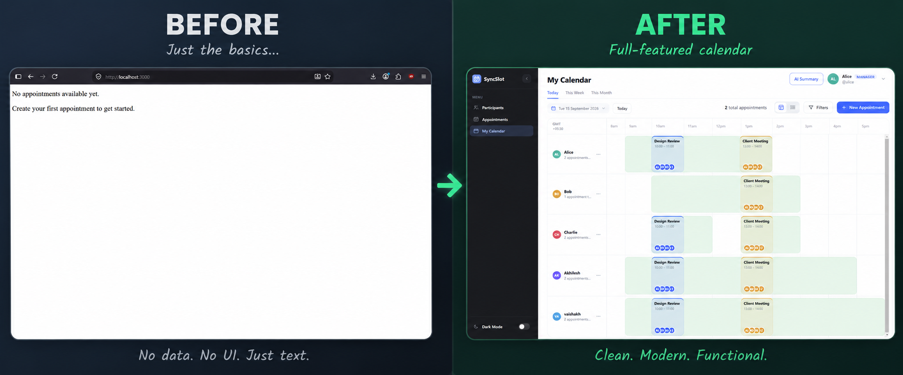
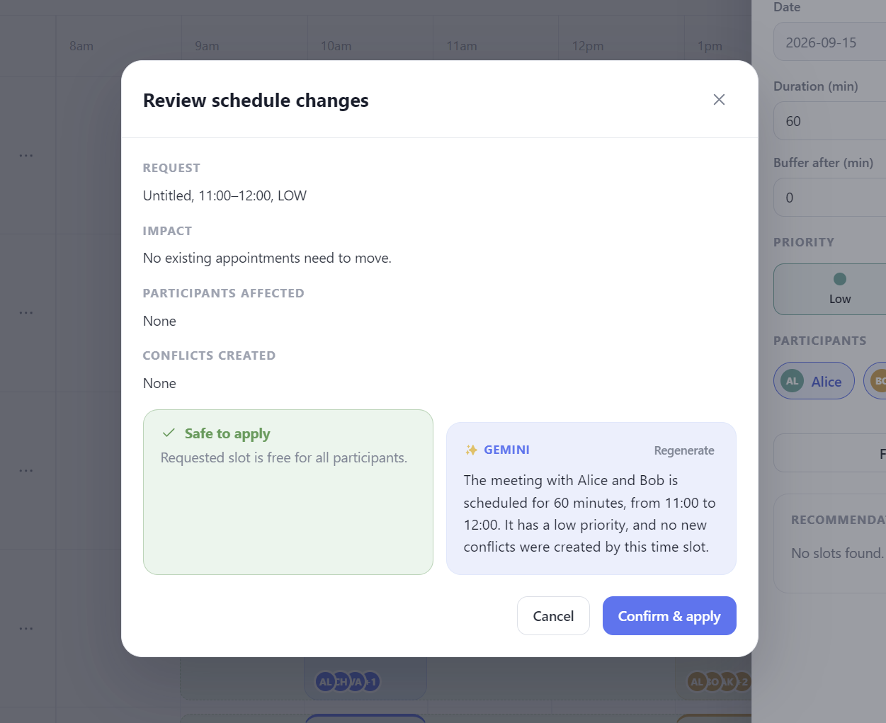
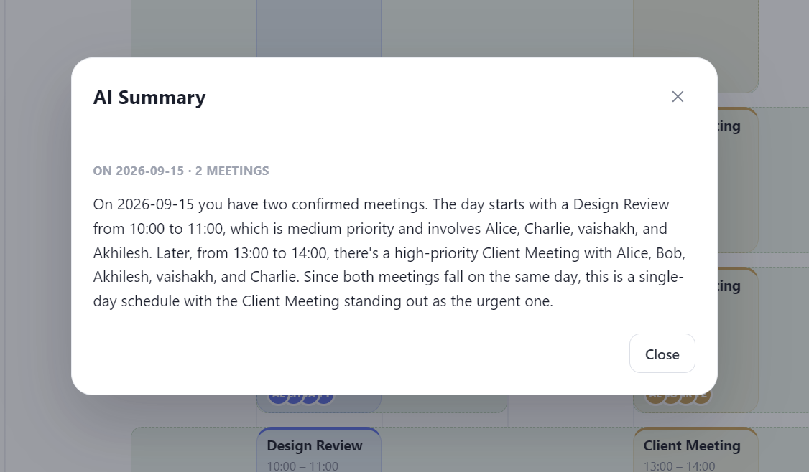
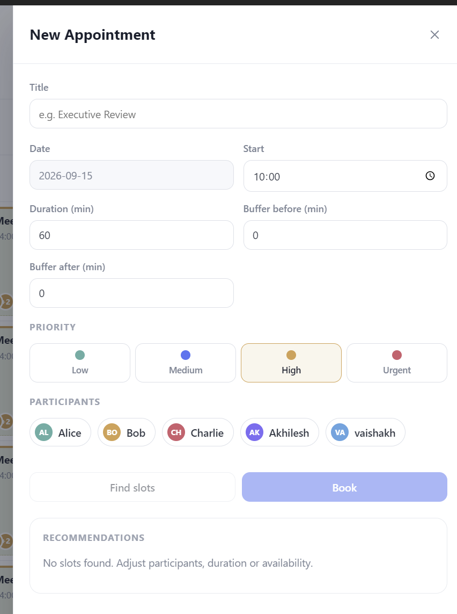

# SyncSlot — Smart Appointment Coordinator

> **Turn appointment scheduling from back-and-forth coordination into a constraint-aware workflow.**



SyncSlot is a smart appointment coordination system built around one core idea: **finding a meeting time is not enough — the system should understand conflicts, explain its decisions, and help users resolve schedule changes safely.**

The project combines a React frontend, Spring Boot scheduling backend, a pure Java scheduling engine, persistent storage, and an Electron desktop shell. Scheduling decisions stay in the backend; the frontend focuses on presenting the calendar, recommendations, conflicts, and confirmations.

---

## ✨ What Changed

The project has evolved substantially from the initial application state.

| Before | Now |
| --- | --- |
| Bare "no appointments" page | Full calendar workspace |
| Minimal appointment display | Multi-participant calendar |
| Manual time selection | **Find Slots** with ranked recommendations |
| No conflict workflow | **Collision/conflict detection** |
| No safe rescheduling flow | **Preview → review → confirm** cascade workflow |
| No schedule intelligence | **AI Summary** and schedule explanations |
| Basic CRUD | Availability-aware, buffer-aware scheduling |
| No visual scheduling controls | Date views, filters, participants and appointment controls |
| Simple web page | React + Spring Boot + Electron desktop architecture |

The comparison above shows the jump from the original minimal UI to the current scheduling workspace.

---

## 🚀 Features

### 📅 Calendar & Scheduling

- Day, week, and month calendar views
- Participant-centric availability visualization
- Appointment creation and management
- Start time, duration, buffer-before and buffer-after controls
- Priority levels: **Low, Medium, High, Urgent**
- Multi-participant appointments
- Availability-aware slot discovery
- Ranked alternative time slots
- Filters and calendar/list presentation modes

### 👥 Participant & Availability Management

SyncSlot models each participant independently and considers their availability when evaluating a meeting.

The scheduling engine works at minute-level granularity and can reason about:

- Multiple participants
- Availability windows
- Existing appointments
- Appointment duration
- Buffers
- Meeting priority
- Candidate slot quality
- Scheduling disruption

---

## 🧠 Intelligent Scheduling

The scheduling engine is the core of SyncSlot.

Instead of simply asking:

> "Is this time free?"

SyncSlot evaluates the complete scheduling situation and can answer:

> "Is this workable for everyone, what conflicts would it create, and what are the best alternatives?"

### Slot ranking

Candidate slots are ranked using a configurable scoring model:

```text
score = wAvail * availabilityFit
      + wPriority * priorityFit
      + wPref * preferenceFit
      + wBuffer * bufferQuality
      - wDisrupt * disruptionCost
```

Weights can be tuned in:

```text
backend/.../algorithm/config/EngineConfig.java
```

This lets the system prefer practical slots rather than returning arbitrary free times.

---

## ⚠️ Collision & Conflict Detection

SyncSlot checks a proposed appointment against existing schedules before applying changes.

The scheduling API exposes:

```text
POST /api/schedule/find-slots
POST /api/schedule/check-conflict
```

When a collision is detected, the system can identify affected appointments and provide alternative options instead of simply rejecting the request.

### Safe cascading rescheduling

For situations where a new appointment conflicts with an existing one, SyncSlot supports a controlled cascade:

```text
Proposed appointment
        │
        ▼
   Conflict check
        │
        ▼
  Find alternatives
        │
        ▼
 Preview cascade
        │
        ▼
 User reviews impact
        │
        ▼
 Explicit confirmation
        │
        ▼
 Apply cascade transactionally
```

The important part is the **explicit approval step**.

SyncSlot does **not** silently move existing meetings.

The backend exposes separate preview and apply operations:

```text
POST /api/schedule/preview-cascade
POST /api/schedule/apply-cascade
```

The preview operation is read-only, while the apply operation persists the confirmed changes.

---

## 🔎 Schedule Change Review

Before applying a schedule change, SyncSlot presents the impact of the proposed operation.



The review workflow communicates:

- The requested appointment
- Existing appointments affected
- Participants affected
- Conflicts created
- Whether the change is safe to apply
- The proposed resolution
- A human-readable explanation
- Explicit **Cancel** / **Confirm & Apply** actions

This makes potentially disruptive schedule changes auditable instead of opaque.

---

## 🤖 AI Schedule Summary

SyncSlot also adds an AI-assisted layer on top of the scheduling data.



The **AI Summary** feature can summarize the current schedule and highlight useful information such as:

- Number of meetings
- Meeting times
- Meeting priorities
- Participants involved
- Important or urgent meetings
- Overall schedule patterns
- Which meeting deserves attention

The API exposes:

```text
POST /api/ai/summary
POST /api/ai/explain
```

The backend also supports a deterministic fallback summary when an LLM is unavailable, so the feature does not make the core scheduling workflow dependent on an external AI response.

---

## ➕ Creating an Appointment

The appointment workflow exposes the scheduling constraints directly instead of hiding them.



When creating an appointment, users can specify:

- Title
- Date
- Start time
- Duration
- Buffer before
- Buffer after
- Priority
- Participants

The **Find slots** workflow can then search for feasible alternatives based on the selected participants and constraints.

---

## 🏗️ Architecture

```text
┌───────────────────────────────┐
│       Windows / Electron      │
│        Desktop Shell          │
└───────────────┬───────────────┘
                │
                ▼
┌───────────────────────────────┐
│        React Frontend         │
│       Vite + JSX + CSS        │
└───────────────┬───────────────┘
                │ HTTP / JSON
                ▼
┌───────────────────────────────┐
│        Spring Boot API        │
│ REST + Scheduling Services     │
├───────────────────────────────┤
│ SchedulingService              │
│ ConflictService                │
│ CascadeService                 │
│ SlotRankingService             │
│ AiSummaryService               │
│ AiExplainService               │
└───────────────┬───────────────┘
                │
                ▼
┌───────────────────────────────┐
│       Pure Java Engine        │
│ Minute-level scheduling       │
│ Conflict detection            │
│ Slot ranking                  │
│ Cascade planning              │
└───────────────┬───────────────┘
                │
                ▼
┌───────────────────────────────┐
│       JPA / Hibernate         │
│        H2 / optional MySQL    │
└───────────────────────────────┘
```

### Design principle

**All scheduling decisions live in the Java backend.**

The React frontend calls the REST API and renders the resulting state. This keeps the scheduling rules centralized and makes the engine independently testable.

---

# 🛠️ Installation & Setup

## 1. Prerequisites

Install the following before running SyncSlot:

- **Java 17+**
- **Maven 3.8+**
- **Node.js 18+**
- **npm**

Check your installations:

```bash
java -version
mvn -version
node -v
npm -v
```

---

## 2. Clone the repository

```bash
git clone https://github.com/notexactlynikhil/SynCal.git
cd SynCal
```

---

## 3. Start the Spring Boot backend

Open a terminal in the project root:

```bash
cd backend
mvn spring-boot:run
```

The backend starts on:

```text
http://localhost:8080
```

### Database

The default setup uses **H2**, so no external database installation is required.

The local database is stored under:

```text
backend/data/syncslot
```

The application seeds the demo data on first startup.

### Optional MySQL profile

If you want to use MySQL instead:

```bash
mvn spring-boot:run -Dspring-boot.run.profiles=mysql
```

Configure the MySQL connection using the project's Spring configuration before using this profile.

---

## 4. Start the React frontend

Open another terminal:

```bash
cd frontend
npm install
npm run dev
```

Vite serves the frontend at:

```text
http://localhost:5173
```

The frontend communicates with the Spring Boot API on port `8080`.

---

## 5. Run the Electron desktop shell

Open a third terminal:

```bash
cd electron
npm install
npm start
```

During development, Electron loads the Vite frontend.

### Development order

For the complete application, start the services in this order:

```text
Terminal 1 → backend
Terminal 2 → frontend
Terminal 3 → electron
```

---

# 📡 REST API

| Method | Endpoint | Purpose |
| --- | --- | --- |
| GET | `/api/users` | List participants |
| POST | `/api/users` | Create a participant |
| GET | `/api/availability` | List availability |
| POST | `/api/availability` | Create availability |
| PUT | `/api/availability/{id}` | Update availability |
| DELETE | `/api/availability/{id}` | Delete availability |
| GET | `/api/appointments` | List appointments |
| POST | `/api/appointments` | Create appointment |
| PUT | `/api/appointments/{id}` | Update appointment |
| DELETE | `/api/appointments/{id}` | Delete appointment |
| POST | `/api/schedule/find-slots` | Find and rank free slots |
| POST | `/api/schedule/check-conflict` | Detect conflicts and alternatives |
| POST | `/api/schedule/preview-cascade` | Preview a cascade without modifying data |
| POST | `/api/schedule/apply-cascade` | Apply a confirmed cascade |
| POST | `/api/ai/summary` | Generate a schedule summary |
| POST | `/api/ai/explain` | Generate a schedule explanation |

---

# 🧪 Testing

Run the backend test suite:

```bash
cd backend
mvn test
```

The project includes tests covering the scheduling engine, cascade behavior, HTTP/API flows, and AI summary behavior.

Important test areas include:

- Scheduling engine scenarios
- Conflict detection
- Slot ranking
- Cascade preview purity
- Cascade persistence
- Scheduling API flow
- AI summary endpoint
- Deterministic AI fallback behavior

---

# 🎯 Demo Scenario

The application includes a seeded multi-participant scenario for demonstrating conflict resolution.

Example participants:

```text
Alice
Bob
Charlie
```

The scheduling engine can evaluate a new appointment against their existing availability and appointments, identify collisions, rank alternatives, and produce a cascade preview before anything is changed.

This makes the demo useful for showing the complete workflow:

```text
Create appointment
      ↓
Check participant availability
      ↓
Detect collision
      ↓
Rank alternatives
      ↓
Preview schedule impact
      ↓
Review explanation
      ↓
Confirm
      ↓
Apply changes
```

---

# 📂 Project Structure

```text
SynCal/
├── backend/
│   ├── src/
│   │   ├── main/
│   │   │   └── java/
│   │   │       └── com/syncslot/
│   │   └── test/
│   ├── data/
│   └── pom.xml
│
├── frontend/
│   ├── src/
│   │   ├── components/
│   │   ├── context/
│   │   ├── pages/
│   │   └── services/
│   ├── package.json
│   └── vite.config.js
│
├── electron/
│   ├── main.js
│   └── package.json
│
└── docs/
    └── screenshots/
```

---

# 🔐 Scheduling Safety

SyncSlot is designed around **predictable and explainable scheduling changes**.

The system follows three important rules:

1. **Do not silently move existing appointments.**
2. **Preview potentially disruptive changes before applying them.**
3. **Require explicit confirmation before a cascade is persisted.**

This separates *finding a solution* from *committing a solution*.

---

# 🧰 Tech Stack

### Frontend

- React 18
- JSX
- HTML5
- CSS3
- Vite
- npm

### Backend

- Java 17
- Spring Boot 3.3
- Spring Web
- REST / JSON
- Spring Data JPA
- Hibernate
- Maven

### Database

- H2 — default local/demo database
- MySQL — optional

### Desktop

- Electron

### Testing

- JUnit
- Spring Boot Test
- MockMvc/API tests

### Intelligence

- Rule-based scheduling engine
- Conflict detection
- Ranked slot selection
- Bounded cascade rescheduling
- AI-assisted schedule summary/explanation
- Deterministic fallback when AI is unavailable

---

# 📈 From Prototype to Product

SyncSlot's development can be thought of as three layers:

### 1. Core scheduling

The original scheduling engine established the foundation:

- Availability calculation
- Multi-person scheduling
- Buffers
- Priorities
- Conflict detection
- Slot ranking

### 2. Safe workflow

The application then grew from an algorithm into an actual scheduling product:

- Calendar UI
- Participants
- Appointment management
- Find Slots
- Conflict review
- Cascade preview
- Explicit apply/confirm workflow

### 3. Intelligent experience

The latest layer adds higher-level assistance:

- AI schedule summaries
- AI schedule explanations
- Human-readable conflict reasoning
- Better visual feedback
- More complete desktop UI

The result is no longer just a scheduling algorithm — it is a complete workflow for **creating, evaluating, explaining, and safely changing appointments**.

---

## 📸 Screenshots

### Calendar


### AI Summary


### New Appointment


### Schedule Change Review


---

## 📄 License

This project currently does not specify a repository license.
